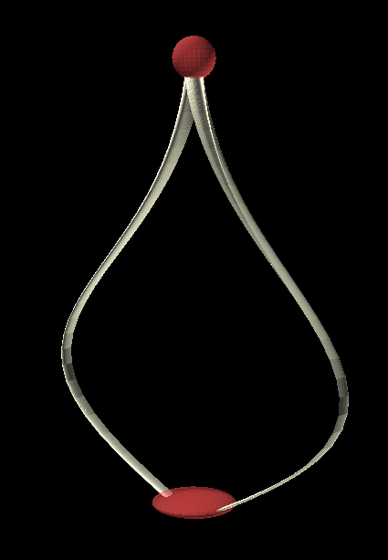

# Darrieus-Ugrinsky-VAWT
Self-starting hybrid Darrieus-Ugrinsky vertical axis wind turbine
(VAWT) morphs from a Darrieus type to a Ugrinsky type

Darrieus type VAWT: high efficiency

Ugrinsky type VAWT: self starting

The NACA airfoil sharp edge splits open like a peapod
towards the top, creating drag as it catches wind to start.
At the top the vanes unfurl fully to a Ugrinsky profile.
The airfoil perimeter (sheet metal width) remains constant.
